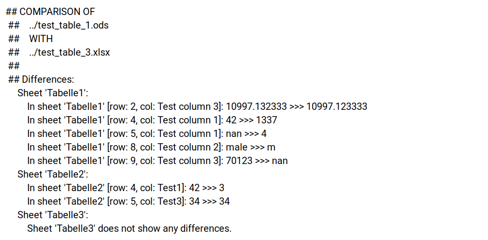

# SpreadSheetDiff

A tool to compare two excel files with annotation of the differences. The files 
to be compared must have the same basic structure. That means the labels and the 
number of their sheets must be the same in both files. 

## Download and Installation for Linux:

### Install or upgrade pip:
````
sudo apt install python3-pip
pip3 install --upgrade pip
````
[//]: # (&#40;requires pip>=22.2.1&#41;)

Clone the repo or download the latest release in .zip or .tar.gz format.

### Download and extract repository in .tar.gz format: 

Check if `wget` is installed:
````
which wget; echo $?
````
If `wget` isn't installed, it's command returns 1.

If necessary install `wget`:
````
sudo apt install wget
````

For .tar.gz format execute the following command in terminal:
````
wget https://github.com/AntonieV/SpreadSheetDiff/archive/refs/tags/latest.tar.gz -O - | tar -xz
````

### Alternatively: download and extract repository in .zip format: 
Check if `unzip` and `wget` are installed:
````
which unzip; echo $?
which wget; echo $?
````
If one of the tools isn't installed, it's command returns 1.
If necessary install `wget` and/or `unzip`:
````
sudo apt install unzip
sudo apt install wget
````

For .zip format execute the following command in terminal:
````
wget https://github.com/AntonieV/SpreadSheetDiff/archive/refs/tags/latest.zip
unzip latest.zip
rm latest.zip
````

### Installation:
````
cd SpreadSheetDiff
pip3 install .
````

## Compare two Excel/OpenOffice files:

### Input files:

As input .xlsx or .ods files are accepted.

### Output files:

The differences are stored in the cells of an .xlsx results file. A difference
is marked in corresponding cell with `>>>` annotation between the different 
values: `[value of first input file] >>> [value of second input file]`


In addition, they are stored with the corresponding cell localization 
(sheet name, row and column) in a SpreadSheetDiff_annotations file in 
.txt format:



### Help:

````
spreadsheetdiff -h
````


### Example package execution:
````
spreadsheetdiff -v -i ../file_1.ods ../file_2.ods -o ../diff
````


### Example for local execution of the main method:

````
python3 spreadsheetdiff/main.py -v -i ../file_1.xlsx ../file_2.ods -o ../diff
````

## Uninstall package:
````
pip3 uninstall spreadsheetdiff
````


